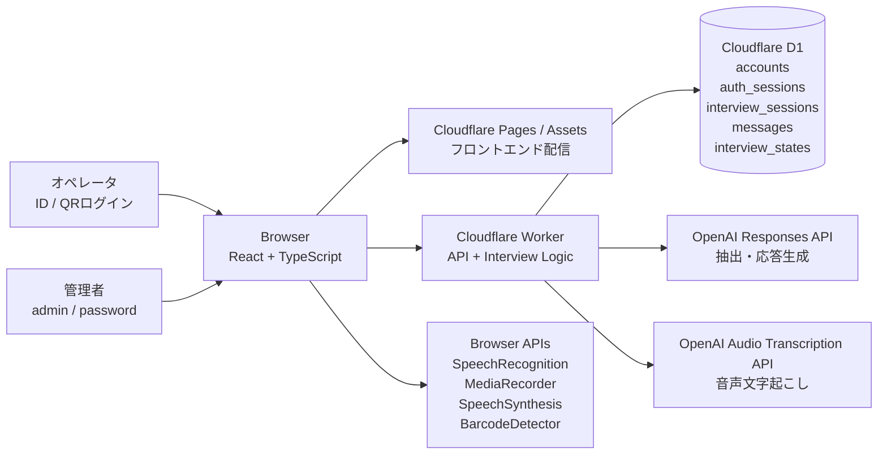
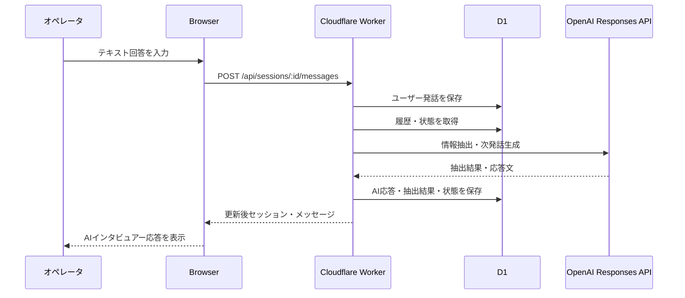
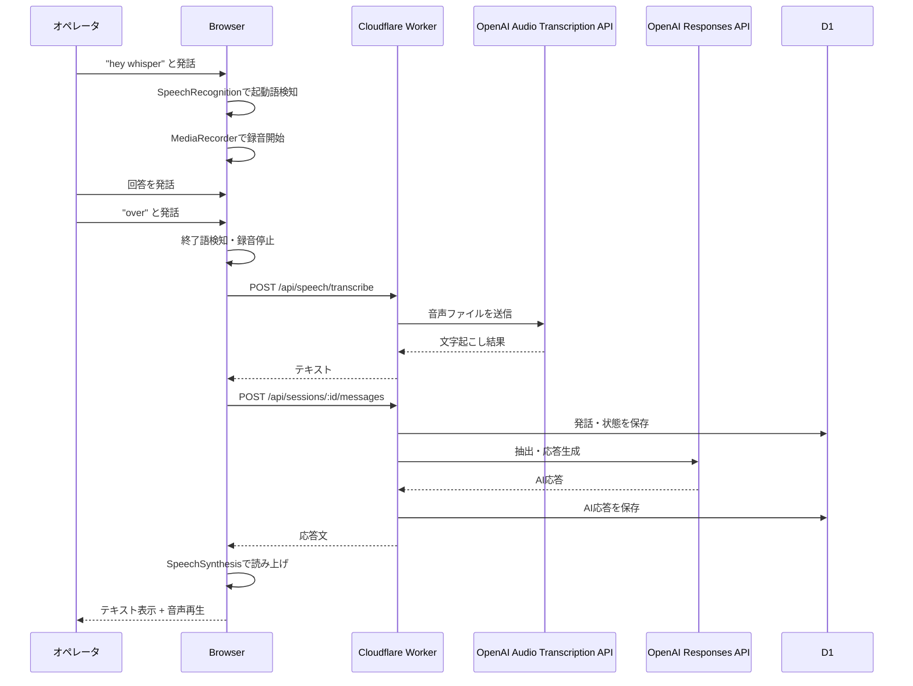
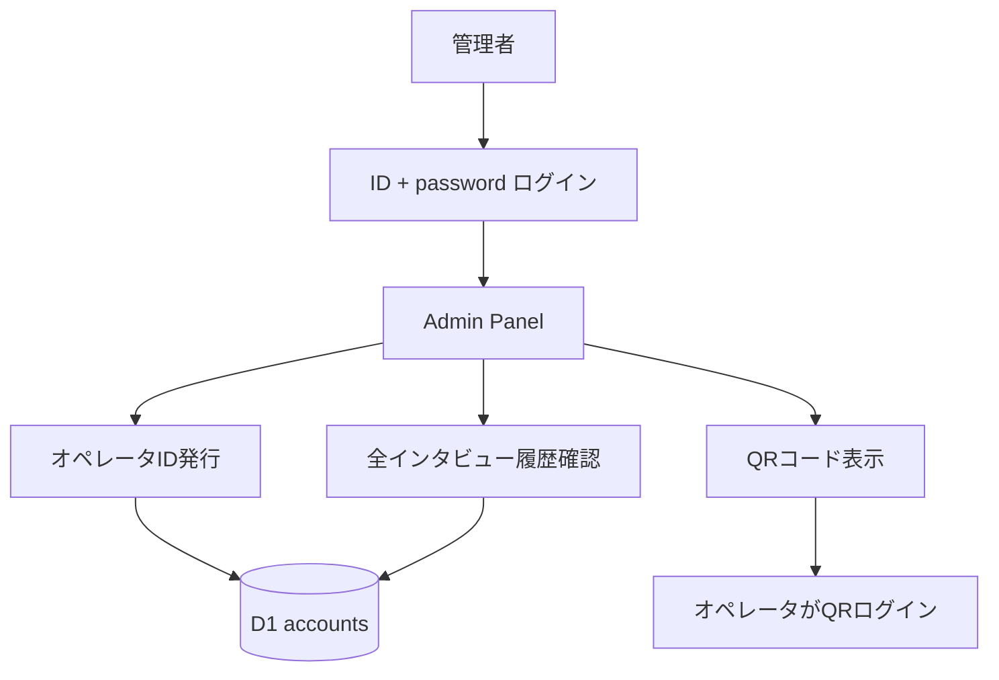
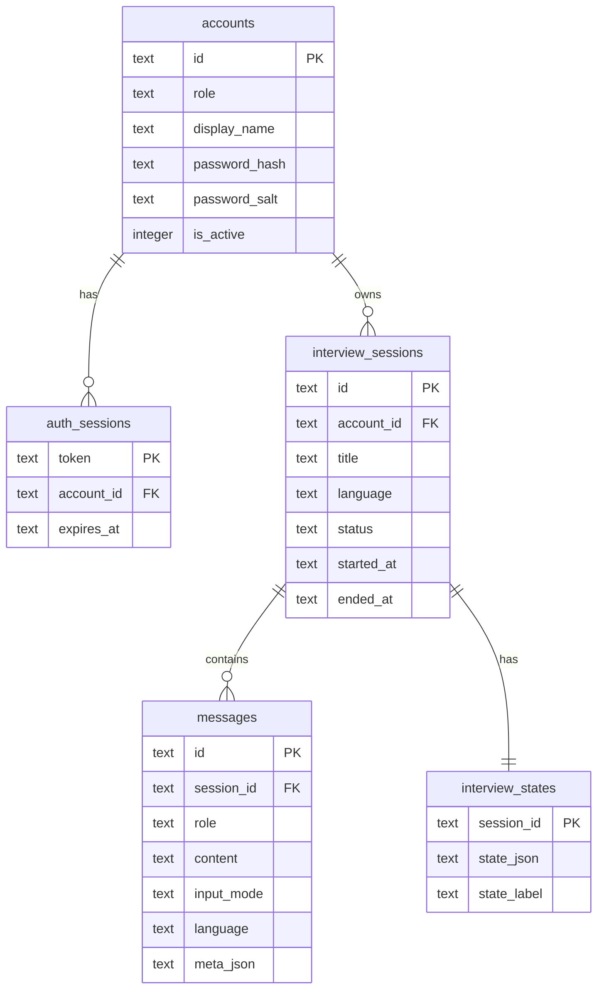

# Audio Interview アーキテクチャ図

## 全体構成

```mermaid
flowchart LR
  operator[オペレータ<br/>ID / QRログイン] --> browser[Browser<br/>React + TypeScript]
  admin[管理者<br/>admin / password] --> browser

  browser --> pages[Cloudflare Pages / Assets<br/>フロントエンド配信]
  browser --> worker[Cloudflare Worker<br/>API + Interview Logic]

  worker --> d1[(Cloudflare D1<br/>accounts<br/>auth_sessions<br/>interview_sessions<br/>messages<br/>interview_states)]
  worker --> openaiText[OpenAI Responses API<br/>抽出・応答生成]
  worker --> openaiAudio[OpenAI Audio Transcription API<br/>音声文字起こし]

  browser --> speech[Browser APIs<br/>SpeechRecognition<br/>MediaRecorder<br/>SpeechSynthesis<br/>BarcodeDetector]
```

## 通常のテキストインタビュー

```mermaid
sequenceDiagram
  participant U as オペレータ
  participant B as Browser
  participant W as Cloudflare Worker
  participant D as D1
  participant O as OpenAI Responses API

  U->>B: テキスト回答を入力
  B->>W: POST /api/sessions/:id/messages
  W->>D: ユーザー発話を保存
  W->>D: 履歴・状態を取得
  W->>O: 情報抽出・次発話生成
  O-->>W: 抽出結果・応答文
  W->>D: AI応答・抽出結果・状態を保存
  W-->>B: 更新後セッション・メッセージ
  B-->>U: AIインタビュアー応答を表示
```

## 音声インタビュー

```mermaid
sequenceDiagram
  participant U as オペレータ
  participant B as Browser
  participant W as Cloudflare Worker
  participant A as OpenAI Audio Transcription API
  participant O as OpenAI Responses API
  participant D as D1

  U->>B: "hey whisper" と発話
  B->>B: SpeechRecognitionで起動語検知
  B->>B: MediaRecorderで録音開始
  U->>B: 回答を発話
  U->>B: "over" と発話
  B->>B: 終了語検知・録音停止
  B->>W: POST /api/speech/transcribe
  W->>A: 音声ファイルを送信
  A-->>W: 文字起こし結果
  W-->>B: テキスト
  B->>W: POST /api/sessions/:id/messages
  W->>D: 発話・状態を保存
  W->>O: 抽出・応答生成
  O-->>W: AI応答
  W->>D: AI応答を保存
  W-->>B: 応答文
  B->>B: SpeechSynthesisで読み上げ
  B-->>U: テキスト表示 + 音声再生
```

## 管理者機能

```mermaid
flowchart TD
  admin[管理者] --> login[ID + password ログイン]
  login --> adminPanel[Admin Panel]
  adminPanel --> issue[オペレータID発行]
  adminPanel --> qr[QRコード表示]
  adminPanel --> histories[全インタビュー履歴確認]

  issue --> d1[(D1 accounts)]
  histories --> d1
  qr --> operator[オペレータがQRログイン]
```

## データ保存

```mermaid
erDiagram
  accounts ||--o{ auth_sessions : has
  accounts ||--o{ interview_sessions : owns
  interview_sessions ||--o{ messages : contains
  interview_sessions ||--|| interview_states : has

  accounts {
    text id PK
    text role
    text display_name
    text password_hash
    text password_salt
    integer is_active
  }

  auth_sessions {
    text token PK
    text account_id FK
    text expires_at
  }

  interview_sessions {
    text id PK
    text account_id FK
    text title
    text language
    text status
    text started_at
    text ended_at
  }

  messages {
    text id PK
    text session_id FK
    text role
    text content
    text input_mode
    text language
    text meta_json
  }

  interview_states {
    text session_id PK
    text state_json
    text state_label
  }
```
