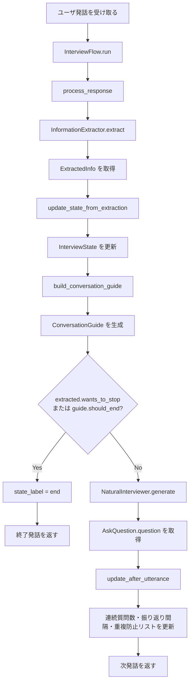

# インタビューエージェントのアルゴリズム

## 対象範囲

この報告では、外部入出力、配信、永続化、API エンドポイントの処理は除き、インタビューエージェントとしての中核アルゴリズムだけを対象にする。

対象コードは次の 2 ファイルである。

- `src/ResilienceInterviewer.py`
  - `InterviewFlow`
  - 状態更新
  - 終了判定
  - 会話方針生成
  - 生成後の会話制御
- `src/openai_api.py`
  - `ExtractedInfo`
  - `InterviewState`
  - `ConversationGuide`
  - `InformationExtractor`
  - `NaturalInterviewer`

## アルゴリズム概要

このエージェントは、LLM に会話制御を全て任せるのではなく、次の 2 段構成で動く。

1. LLM による情報抽出
   - 最新のユーザ発話、現在のインタビュー状態、対話履歴を入力する。
   - `ExtractedInfo` という構造化データを得る。

2. ルールベースの進行制御
   - `ExtractedInfo` をもとに `InterviewState` を更新する。
   - `InterviewState` と `ExtractedInfo` から `ConversationGuide` を作る。
   - 終了条件を満たす場合は終了する。
   - 継続する場合は、`ConversationGuide` を LLM に渡して次発話を生成する。

中心となる状態変数は以下である。

| 変数 | 意味 |
| --- | --- |
| `target_work` | インタビュー対象の主題業務 |
| `task_coverage` | 対象業務の流れ、状況、実践がどの程度見えているか |
| `task_depth` | 理由、価値観、本音、経験、源泉までどの程度深まっているか |
| `irregular_coverage` | イレギュラー状況と対応がどの程度見えているか |
| `rapport` | 関係構築度 |
| `known_facts` | 既に分かっていること |
| `asked_points` | 既に聞いたこと、聞き直すべきでないこと |
| `persona_notes` | 相手の人柄、仕事観、立場に関するメモ |
| `consecutive_questions` | 連続質問数 |
| `turns_since_reflection` | 理解返しなしで質問・情報回収が続いたターン数 |
| `friction_count` | 重複、脱線、誤解への不満の回数 |
| `resistance_count` | 答えづらさ、拒否感の回数 |

## フローチャート



## 疑似コード

```pseudo
initialize InterviewFlow:
    chat_history = ChatHistory(user_id)
    state = InterviewState()
    state_label = "running"
    extractor = InformationExtractor()
    interviewer = NaturalInterviewer()

function start():
    first_utterance =
        "先ほどはどんな業務をしていましたか？"
        "その時の状況も含めて、軽く教えてください。"
    chat_history.add_message("system", first_utterance)
    return first_utterance

function run(user_input):
    next_utterance = process_response(user_input)
    chat_history.add_message("system", next_utterance)
    return next_utterance

function process_response(response):
    extracted = extractor.extract(
        user_response = response,
        state = state,
        chat_history = chat_history.dump_messages()
    )

    update_state_from_extraction(extracted)

    guide = build_conversation_guide(extracted)

    if extracted.wants_to_stop or guide.should_end:
        state_label = "end"
        return "ありがとうございました。これでインタビューを終了します。"

    utterance = interviewer.generate(
        guide = guide,
        state = state,
        latest_answer = response,
        chat_history = chat_history.dump_messages()
    )

    update_after_utterance(utterance)
    return utterance.question
```

## 情報抽出モデル

`InformationExtractor.extract()` は、直前のユーザ発話から以下を抽出する。

| フィールド | 意味 |
| --- | --- |
| `target_work` | 主題業務 |
| `situations` | 業務の状況・場面 |
| `practices` | 業務中にしていること、進め方、確認、対応 |
| `reasons` | 実践や構えの理由 |
| `values` | 価値観、本音、仕事観、責任感 |
| `sources` | 経験、教育、教え、源泉 |
| `irregular_situations` | イレギュラーな状況 |
| `irregular_responses` | イレギュラー時の対応・構え |
| `persona_notes` | 人柄、役割、仕事観、立場のメモ |
| `emotions` | 感情、疲れ、困惑、葛藤 |
| `user_questions` | 相手からの逆質問や確認 |
| `signs_of_friction` | 重複、脱線、誤解への不満 |
| `signs_of_resistance` | 答えづらさ、拒否感、話したくなさ |
| `signs_of_no_information` | 分からない、覚えていない、情報がない |
| `wants_to_stop` | 明確な終了希望 |

## 状態更新アルゴリズム

`update_state_from_extraction()` は、抽出結果をインタビュー状態へ反映する。

```pseudo
function update_state_from_extraction(info):
    state.turn_count += 1

    if info.target_work exists:
        state.target_work = info.target_work
        state.task_coverage = max(state.task_coverage, 0.20)
        known_facts.add("対象業務: " + info.target_work)

    for each item in info.situations:
        known_facts.add("状況: " + item)
    if info.situations exists:
        state.task_coverage = min(1.0, state.task_coverage + 0.10)

    for each item in info.practices:
        known_facts.add("業務上の実践: " + item)
    if info.practices exists:
        state.task_coverage = min(1.0, state.task_coverage + 0.10)
        state.task_depth = max(state.task_depth, 2)

    for each item in info.reasons:
        known_facts.add("理由: " + item)
    if info.reasons exists:
        state.task_depth = max(state.task_depth, 3)

    for each item in info.sources:
        known_facts.add("源泉: " + item)
    if info.sources exists:
        state.task_depth = max(state.task_depth, 4)

    for each item in info.values:
        known_facts.add("価値観: " + item)
    if info.values exists:
        state.task_depth = max(state.task_depth, 5)

    for each item in info.irregular_situations:
        known_facts.add("イレギュラー状況: " + item)
    if info.irregular_situations exists:
        state.irregular_coverage = min(1.0, state.irregular_coverage + 0.25)

    for each item in info.irregular_responses:
        known_facts.add("イレギュラー時の対応: " + item)
    if info.irregular_responses exists:
        state.irregular_coverage = min(1.0, state.irregular_coverage + 0.35)

    for each item in info.persona_notes:
        persona_notes.add(item)
    if info.persona_notes exists:
        state.rapport = min(1.0, state.rapport + 0.08)

    for each item in info.emotions:
        known_facts.add("感情・状態: " + item)
    if info.emotions exists:
        state.rapport = min(1.0, state.rapport + 0.05)

    for each item in info.user_questions:
        known_facts.add("相手からの確認: " + item)

    for each item in info.signs_of_friction:
        asked_points.add(item)
    if info.signs_of_friction exists:
        state.friction_count += 1
        state.rapport = max(0.0, state.rapport - 0.12)

    for each item in info.signs_of_resistance:
        asked_points.add(item)
    if info.signs_of_resistance exists:
        state.resistance_count += 1
        state.rapport = max(0.0, state.rapport - 0.05)

    for each item in info.signs_of_no_information:
        asked_points.add(item)

    if info has informative content:
        state.rapport = min(1.0, state.rapport + 0.03)
```

情報量のある発話とは、以下のいずれかが存在する発話である。

- `target_work`
- `situations`
- `practices`
- `reasons`
- `values`
- `sources`
- `irregular_situations`
- `irregular_responses`
- `persona_notes`
- `emotions`

## 終了条件

終了条件は以下である。

```pseudo
should_end_interview =
    state.task_coverage >= 0.7
    and state.task_depth >= 5
    and state.irregular_coverage >= 0.7
```

また、構造化抽出で `wants_to_stop == true` が返った場合も終了する。

終了時は以下を返す。

```text
ありがとうございました。これでインタビューを終了します。
```

## 会話方針生成アルゴリズム

`build_conversation_guide()` は、条件を上から順に評価し、最初に一致した `ConversationGuide` を採用する。

```pseudo
function build_conversation_guide(info):
    if should_end_interview():
        return guide(
            should_ask_question = false,
            should_end = true,
            guidance = "必要な情報は概ね得られたため、自然に終了する。",
            priorities = ["感謝して終了する"]
        )

    if info.signs_of_friction exists:
        return guide(
            should_ask_question = false,
            should_repair = true,
            guidance =
                "相手が重複・脱線・誤解を指摘している。"
                "まず謝る。次に、既に分かっていることを短く正しく言い直す。"
                "このターンでは新しい質問をしない。",
            priorities = [
                "謝る",
                "既に分かっている内容を正しく言い直す",
                "質問しない"
            ]
        )

    if info.user_questions exists:
        return guide(
            should_ask_question = true,
            should_answer_user_question = true,
            guidance =
                "相手が逆質問している。"
                "文脈に沿って，質問に対する回答をしたり，自然な会話をする。",
            priorities = [
                "相手の質問に対して答える",
                "質問の範囲を狭めて答えやすくする"
            ],
            dice_hint = "C"
        )

    if state.consecutive_questions >= 2:
        return guide(
            should_ask_question = false,
            guidance =
                "質問が続いている。仕事に対する姿勢を知れるようなその業務やその人にまつわる軽い質問または確認をする"
                "対象業務について分かってきたことを短く言語化しながら",
            priorities = [
                "理解を返す",
                "業務や人柄への関心を自然に示す"
            ]
        )

    if info.signs_of_resistance exists or info.signs_of_no_information exists:
        return guide(
            should_ask_question = false,
            guidance =
                "相手が答えづらそう、または情報が出にくい。"
                "無理に深掘りせず、対話履歴に沿った質問をする"
                "必要ならここまで分かっていることを短くまとめる。",
            priorities = [
                "会話の圧を下げる",
                "質問しない",
                "これまでの発話内容を丁寧に見返す",
                "印象に残ったエピソードや工夫みたいな類の聞きかたはNG"
            ]
        )

    if state.turns_since_reflection >= 3:
        return guide(
            should_ask_question = false,
            guidance =
                "ここまで質問や情報回収が続いている。"
                "次は質問せず、分かってきた業務の見え方やその人らしさを返しつつ，適切な質問や相槌を打つ。",
            priorities = [
                "ここまでの理解を返す",
                "相手の仕事ぶりへの理解を示す",
                "質問しない"
            ]
        )

    if state.task_coverage < 0.7:
        return guide(
            should_ask_question = true,
            guidance =
                "対象業務の流れ・場面・仕事の進め方の理解がまだ浅い。"
                "ただし『どんな工夫』『具体的に』とは聞かず、"
                "相手の直前発話に乗って自然に業務の様子を聞く。",
            priorities = [
                "対象業務の様子を理解する",
                "相手の直前発話に乗る",
                "質問攻めにしない"
            ],
            dice_hint = "D"
        )

    if state.task_depth < 5:
        return guide(
            should_ask_question = true,
            guidance =
                "対象業務の表面的な流れは見えてきたが、理由・価値観・本音・経験・源泉はまだ浅い。"
                "ここぞという感じで、相手の発話に含まれる意味を自然に深める。"
                "既に分かっている理由を聞き直さない。",
            priorities = [
                "対象業務(target work)についてであることを補足しながら，それにまつわる意味を深める",
                "ラポールを意識して、相手の発話に乗る",
                "仕事観や価値観を自然に探る"
            ],
            dice_hint = "E"
        )

    if state.irregular_coverage < 0.7:
        return guide(
            should_ask_question = true,
            guidance =
                "対象の業務についてはある程度見えてきた。"
                "その対象の業務における，イレギュラーな状況や困った場面があるのか，またどう対処するかに軽く触れる。"
                "細かい手順や具体例をしつこく求めない。",
            priorities = [
                "イレギュラー時の構えを軽く確認する",
                "深掘りしすぎない",
                "既に出た価値観を前提にする"
            ],
            dice_hint = "C"
        )

    if state.task_depth == 5:
        return guide(
            should_ask_question = true,
            guidance =
                "対象業務についてとそれに関する考え方は分かってきた。"
                "ここからは、相手の発話に乗りつつ、その考え方を育んだ個人的な考え方やパーソナルな部分により踏み込んでいく"
                "既に分かっている理由を聞き直さない。",
            priorities = [
                "ラポールを意識して、相手の発話に乗る",
                "考え方を育んだパーソナルな考え方や会社や社会に対する考えを引き出す"
                "仕事観や価値観を自然に探る"
            ]
        )

    return guide(
        should_ask_question = false,
        guidance =
            "情報は概ね足りている。"
            "自然にここまでの理解を返し、終了に向かう。",
        priorities = [
            "理解を返す",
            "感謝する"
        ]
    )
```

全ての `ConversationGuide` には、以下も付与される。

- `avoid_reasking`: `known_facts` と `asked_points` と、対象業務から離れないための注意をまとめたもの。
- `use_as_known`: `target_work`、`known_facts`、`persona_notes` を既知情報としてまとめたもの。

## 重複防止・既知情報利用

`build_use_as_known()` は、次発話生成時に既知前提として使う情報を作る。

```pseudo
function build_use_as_known():
    items = []

    if state.target_work exists:
        items.add("対象業務: " + state.target_work)

    items.extend(state.known_facts)
    items.extend("人柄・仕事観メモ: " + each persona_note)

    return unique_nonempty(items)
```

`build_avoid_reasking()` は、聞き直し防止のための情報を作る。

```pseudo
function build_avoid_reasking():
    items = []
    items.extend(state.known_facts)
    items.extend(state.asked_points)

    if state.target_work exists:
        items.add("対象業務は {target_work}。別業務へ勝手に移らない。")

    return unique_nonempty(items)
```

`unique_nonempty()` は、空文字を除き、重複を取り除いた順序付きリストを返す。

## 生成後の会話制御

`update_after_utterance()` は、生成された発話が質問かどうかで会話制御状態を更新する。

```pseudo
function update_after_utterance(utterance):
    text = utterance.question.strip()
    is_question = "?" in text or "？" in text

    if is_question:
        state.consecutive_questions += 1
        state.turns_since_reflection += 1
        asked_points.add("過去の質問: " + text)
    else:
        state.consecutive_questions = 0
        state.turns_since_reflection = 0
        state.rapport = min(1.0, state.rapport + 0.04)

    state.known_facts = last 30 items
    state.asked_points = last 30 items
    state.persona_notes = last 20 items
```

## プロンプト原文: 情報抽出

`InformationExtractor.extract()` のプロンプト原文は以下である。

```text
あなたは半構造化インタビューの情報抽出器です。
直前のインタビュイ発話から、対象業務に関する情報を構造化してください。

重要:
- キーワード一致ではなく、対話の流れで判断する。
- 想像で補わない。
- 既に分かっていることは、必要に応じて維持してよいが、最新回答にないことを無理に追加しない。
- reason/source は独立した質問項目ではなく、対象業務の深さを高める材料。
- friction は、相手が「さっき言った」「同じこと聞かないで」「今はその話」など、重複・脱線・誤解を指摘している場合。
- user_questions は、相手が質問の意味や範囲を確認している場合。

抽出項目:
- target_work:
  一番最初に話していた主題業務。

- situations:
  混雑、休憩直後、忙しい時間帯、特定の客対応などの状況。

- practices:
  業務中にしていること、仕事の進め方、確認、対応。

- reasons:
  その実践や構えの理由。

- values:
  価値観、本音、仕事観、責任感。

- sources:
  経験、教育、教え、源泉。

- irregular_situations:
  想定外、例外、イレギュラーな状況。

- irregular_responses:
  一番最初の主題業務に関する，イレギュラー時の対応・構え。

- persona_notes:
  その人の役割、仕事観、人柄、立場に関するメモ。

- emotions:
  疲れ、困惑、葛藤、嫌さ、嬉しさなど。

- user_questions:
  相手からの逆質問や確認。

- signs_of_friction:
  重複、脱線、誤解への不満。

- signs_of_resistance:
  答えづらさ、拒否感、面倒さ。

- signs_of_no_information:
  特になし、分からない、覚えていないなど。

- wants_to_stop:
  明確に終了したい場合のみ true。

【現在の state】
{state.model_dump_json(ensure_ascii=False)}

【対話履歴】
{chat_history}

【直前のインタビュイ発話】
{user_response}
```

## プロンプト原文: 自然発話生成

`NaturalInterviewer.generate()` のプロンプト原文は以下である。

```text
あなたは半構造化インタビューを行う自然な聞き手です。

基本姿勢:
「お仕事についてお話を聞かせてください」という姿勢で話してください。
相手の業務や人柄を理解しながら、自然な会話として進めてください。

裏で知りたいこと:
- 対象業務がどのように成り立っているか
- その人が何を見て、何を大事にしているか
- 理由、価値観、本音、経験、源泉
- イレギュラーな状況とその対応

必ず守ること:
- guide に従う。
- 対話履歴(chat_history)を踏まえて、自然な会話として発話する。
- should_ask_question が false の場合は、原則として質問しない。
- should_repair が true の場合は、まず謝り、既に分かっていることを正しく言い直す。
- should_answer_user_question が true の場合は、相手の確認・逆質問に短く答える。
- avoid_reasking に含まれることは絶対に聞き直さない。
- use_as_known に含まれることは既知の前提として使う。
- 対象業務から勝手に離れない。

DICEの使い方:
dice_hint がある場合だけ、裏側で軽く参考にする。
- D: 業務の様子が見える方向
- I: その人自身の経験・立場に戻す方向
- C: 曖昧語を業務文脈に接地する方向
- E: 理由・意味づけ・価値観を深める方向

【conversation guide】
{guide.model_dump_json(ensure_ascii=False)}

【現在の state】
{state.model_dump_json(ensure_ascii=False)}

【対話履歴】
{chat_history}

【直前の回答】
{latest_answer}

次の自然な発話を生成してください。
```
